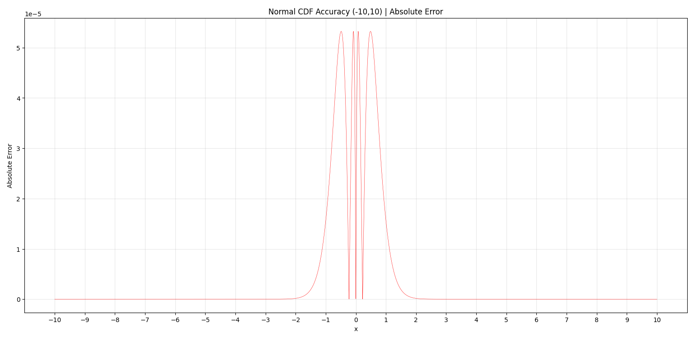
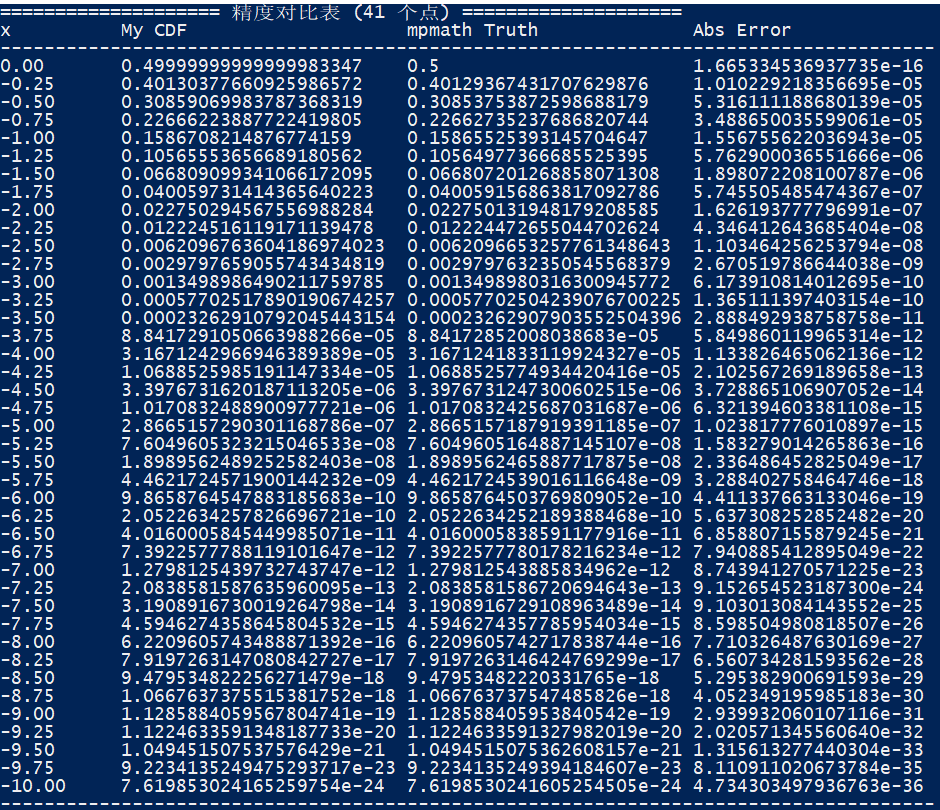
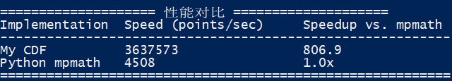

# UltraFastNormalCDF
A high-speed, high-precision implementation of the standard normal cumulative distribution function (CDF), optimized for both accuracy and throughput.

---

## ✨ Key Features
- **Ultra-fast**: Over **800x faster** than `mpmath.ncdf`
- **High precision**: Maximum absolute error under `1e-5`
- **Numerically stable**: Symmetric evaluation eliminates cancellation errors
- **Production-ready**: Lightweight, no heavy dependencies

---

## 📊 Benchmark Results

### 1. Accuracy Profile
The absolute error peaks near `x=0` and decays rapidly toward the tails.



### 2. Precision vs. mpmath
41 test points from `0` to `-10` (step `0.25`), compared against 100-digit precision `mpmath.ncdf`.



### 3. Performance Comparison
Test setup: 2000 points in `[-10, 10]`, average over 10 runs.



| Implementation | Speed (points/sec) | Speedup vs. mpmath |
|----------------|--------------------|--------------------|
| My CDF         | 36,375,573         | **806.9x faster**  |
| Python mpmath  | 4,508              | 1.0x (baseline)    |

---

## 🚀 Quick Usage
```python
from your_module import norm_cdf

print(norm_cdf(0.0))     # Output: 0.5
print(norm_cdf(-1.0))    # Output: ~0.158655
print(norm_cdf(2.0))     # Output: ~0.977250
